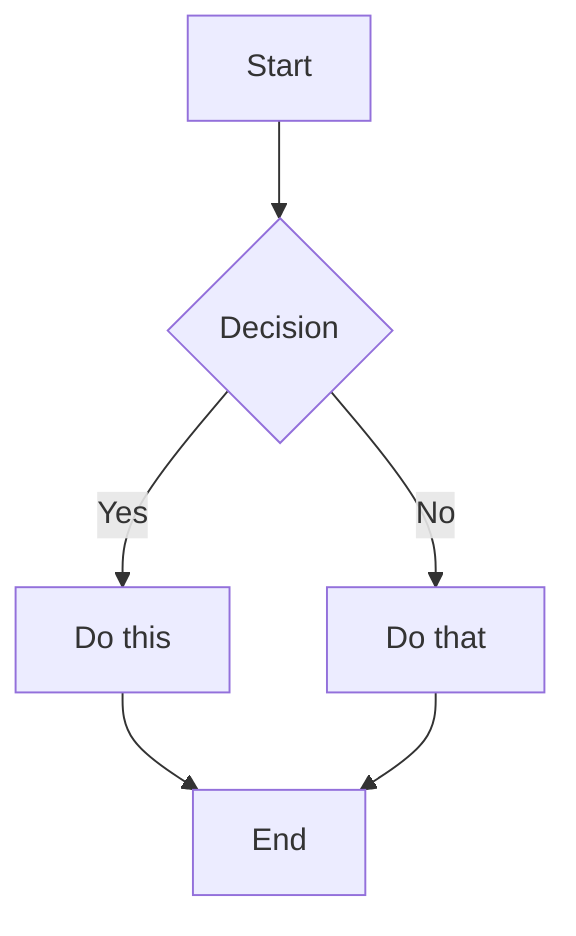
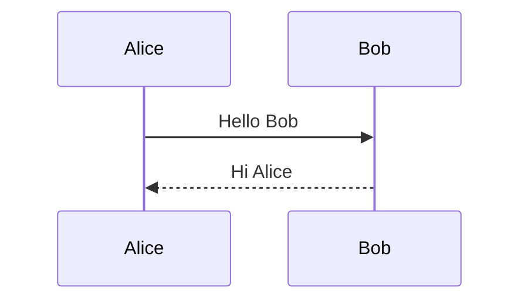

# Obsidian Flavored Markdown Skill

This skill enables skills-compatible agents to create and edit valid Obsidian Flavored Markdown, including all Obsidian-specific syntax extensions and project documentation conventions.

## Overview

Obsidian uses a combination of Markdown flavors:
- [CommonMark](https://commonmark.org/)
- [GitHub Flavored Markdown](https://github.github.com/gfm/)
- [LaTeX](https://www.latex-project.org/) for math
- Obsidian-specific extensions (wikilinks, callouts, embeds, etc.)

---

## Project Documentation Frontmatter Standard

All project notes should use a consistent YAML frontmatter structure. The header comment block identifies the template and stage.

### Complete Frontmatter Template

```yaml
---
# ═══════════════════════════════════════════════════════════════════════════════
# TEMPLATE: [Template Name]
# STAGE: [00-08] - [Stage Name]
# PURPOSE: [One-line description]
# ═══════════════════════════════════════════════════════════════════════════════
tags:
  - type/[note-type]           # What kind of note
  - project/[project-name]     # Which project
  - stage/[00-status]          # Which lifecycle stage
aliases:
  - "[Alternative names]"
cssclass: [styling-class]
# ─────────────────────────────────────────────────────────────────────────────
# NOTE METADATA
# ─────────────────────────────────────────────────────────────────────────────
lead: "One-line summary displayed in callouts"
banner: "![[banner-image.jpg]]"
icon: "🚀"
created: "YYYY-MM-DD"
modified: "YYYY-MM-DD"
template:
  name: "Template Name"
  version: "2.0"
  stage: "00"
# ─────────────────────────────────────────────────────────────────────────────
# PROJECT METADATA
# ─────────────────────────────────────────────────────────────────────────────
project: "[Project Name]"
status: active              # active | paused | completed | archived
phase: discovery            # discovery | validation | build | growth | scale
priority: 3                 # 1=critical → 5=someday
owner: ""
stakeholders: []
deadline: ""
repo: ""
---
```

### Frontmatter Field Reference

| Field | Purpose | Required |
|-------|---------|----------|
| `tags` | Hierarchical categorization | Yes |
| `aliases` | Alternative note names | No |
| `cssclass` | Custom styling | No |
| `lead` | One-line summary for callouts | Yes |
| `banner` | Header image embed | No |
| `icon` | Emoji for visual scanning | Yes |
| `created` | Creation date | Yes |
| `modified` | Last update date | Yes |
| `template.name` | Source template | Yes |
| `template.version` | Template version | Yes |
| `template.stage` | Lifecycle stage (00-08) | Yes |
| `project` | Project name | Yes |
| `status` | Note/project status | Yes |
| `phase` | Lifecycle phase | Yes |
| `priority` | 1-5 priority scale | No |

### Displaying Frontmatter in Notes

Use inline Dataview to display frontmatter values:

```markdown
> [!note] `= this.icon` Note Title
> `= this.lead`

**Status**: `= this.status` | **Phase**: `= this.phase`
```

---

## Tag Taxonomy

Use hierarchical tags for filtering and organization.

### Type Tags (What kind of note)

```
type/moc              # Map of Content
type/dashboard        # Status dashboard
type/roadmap          # Timeline/roadmap
type/decision         # Decision record
type/adr              # Architecture Decision Record
type/analysis         # Market/competitive analysis
type/market           # Market-specific analysis
type/competitive      # Competitor analysis
type/swot             # SWOT analysis
type/persona          # User persona
type/empathy-map      # Empathy mapping
type/interview        # Interview notes
type/research         # General research
type/prd              # Product Requirements Document
type/product          # Product documentation
type/canvas           # Business canvases
type/lean-canvas      # Lean Canvas
type/business-model   # Business Model Canvas
type/value-proposition # Value Proposition Canvas
type/design           # Design documentation
type/ux               # UX/UI design
type/technical        # Technical documentation
type/architecture     # Architecture docs
type/backlog          # Task backlog
type/sprint           # Sprint notes
type/engineering      # Engineering docs
type/experiment       # Validation experiment
type/validation       # Validation-related
type/metrics          # Metrics tracking
type/kpi              # KPI tracking
type/meeting          # Meeting notes
```

### Stage Tags (Project lifecycle stage)

```
stage/00-status       # Status & Roadmap
stage/01-market       # Market Analysis
stage/02-research     # User Research
stage/03-product      # Product Definition
stage/04-design       # Design
stage/05-technical    # Technical
stage/06-engineering  # Engineering
stage/07-analytics    # Analytics & Growth
stage/08-legal        # Legal & Privacy
```

### Project Tags

```
project/[project-name]   # One tag per project (lowercase, hyphenated)
```

---

## Back Matter Standard

Every project note should end with a **Back Matter** section for traceability. Uses Dataview inline fields with `::` syntax.

```markdown
---
## Back Matter

**Source**:: [[Origin Note]]       # Where this came from
**References**:: [[Related Note]]  # Related reading
**Used By**:: [[Consumer Note]]    # Notes that depend on this

---
**Open Questions**
- ❓ Question to investigate

**Action Items**
- [ ] Task to complete
```

### Inline Field Syntax

The `::` syntax creates queryable Dataview fields:

```markdown
**Source**:: [[Note A]], [[Note B]]
**References**:: [[Related Topic]]
**Used By**:: [[Downstream Note]]
```

Query these with Dataview:

```dataview
TABLE Source, References
FROM "Projects"
WHERE contains(Used-By, this.file.link)
```

---

## Basic Formatting

### Paragraphs and Line Breaks

```markdown
This is a paragraph.

This is another paragraph (blank line between creates separate paragraphs).

For a line break within a paragraph, add two spaces at the end  
or use Shift+Enter.
```

### Headings

```markdown
# Heading 1
## Heading 2
### Heading 3
#### Heading 4
##### Heading 5
###### Heading 6
```

### Text Formatting

| Style | Syntax | Example | Output |
|-------|--------|---------|--------|
| Bold | `**text**` or `__text__` | `**Bold**` | **Bold** |
| Italic | `*text*` or `_text_` | `*Italic*` | *Italic* |
| Bold + Italic | `***text***` | `***Both***` | ***Both*** |
| Strikethrough | `~~text~~` | `~~Striked~~` | ~~Striked~~ |
| Highlight | `==text==` | `==Highlighted==` | ==Highlighted== |
| Inline code | `` `code` `` | `` `code` `` | `code` |

### Escaping Formatting

Use backslash to escape special characters:
```markdown
\*This won't be italic\*
\#This won't be a heading
1\. This won't be a list item
```

Common characters to escape: `\*`, `\_`, `\#`, `` \` ``, `\|`, `\~`

---

## Internal Links (Wikilinks)

### Basic Links

```markdown
[[Note Name]]
[[Note Name.md]]
[[Note Name|Display Text]]
```

### Link to Headings

```markdown
[[Note Name#Heading]]
[[Note Name#Heading|Custom Text]]
[[#Heading in same note]]
[[##Search all headings in vault]]
```

### Link to Blocks

```markdown
[[Note Name#^block-id]]
[[Note Name#^block-id|Custom Text]]
```

Define a block ID by adding `^block-id` at the end of a paragraph:
```markdown
This is a paragraph that can be linked to. ^my-block-id
```

---

## Embeds

### Embed Notes

```markdown
![[Note Name]]
![[Note Name#Heading]]
![[Note Name#^block-id]]
```

### Embed Images

```markdown
![[image.png]]
![[image.png|640x480]]    Width x Height
![[image.png|300]]        Width only (maintains aspect ratio)
```

### Embed Canvases

```markdown
![[Canvas Name.canvas]]
```

### Embed PDF

```markdown
![[document.pdf]]
![[document.pdf#page=3]]
![[document.pdf#height=400]]
```

---

## Callouts

### Basic Callout

```markdown
> [!note]
> This is a note callout.

> [!info] Custom Title
> This callout has a custom title.

> [!tip] Title Only
```

### Callout with Dynamic Content

Display frontmatter values in callouts:

```markdown
> [!abstract] `= this.icon` Project Summary
> `= this.lead`
```

### Foldable Callouts

```markdown
> [!faq]- Collapsed by default
> This content is hidden until expanded.

> [!faq]+ Expanded by default
> This content is visible but can be collapsed.
```

### Supported Callout Types

| Type | Aliases | Use Case |
|------|---------|----------|
| `note` | - | General information |
| `abstract` | `summary`, `tldr` | Project summaries, hypotheses |
| `info` | - | Context, background |
| `todo` | - | Action items |
| `tip` | `hint`, `important` | Best practices |
| `success` | `check`, `done` | Completed items |
| `question` | `help`, `faq` | Open questions |
| `warning` | `caution`, `attention` | Risks, concerns |
| `failure` | `fail`, `missing` | Failed experiments |
| `danger` | `error` | Critical issues |
| `bug` | - | Technical bugs |
| `example` | - | Examples, use cases |
| `quote` | `cite` | Citations |
| `experiment` | - | Validation hypotheses (custom) |

---

## Lists

### Task Lists

```markdown
- [ ] Incomplete task
- [x] Completed task
- [ ] Task with sub-tasks
  - [ ] Subtask 1
  - [x] Subtask 2
```

### Priority Tasks

Use priority markers in task lists:

```markdown
- [ ] 🔴 P0 — Critical blocker
- [ ] 🟠 P1 — Important
- [ ] 🟡 P2 — Should have
- [ ] 🟢 P3 — Nice to have
```

---

## Tables

```markdown
| Header 1 | Header 2 | Header 3 |
|----------|----------|----------|
| Cell 1   | Cell 2   | Cell 3   |
| Cell 4   | Cell 5   | Cell 6   |
```

### Alignment

```markdown
| Left     | Center   | Right    |
|:---------|:--------:|---------:|
| Left     | Center   | Right    |
```

### Tables with Links

Escape pipes in wikilinks:

```markdown
| Column 1 | Column 2 |
|----------|----------|
| [[Link\|Display]] | ![[Image\|100]] |
```

---

## Diagrams (Mermaid)

### Flowchart

````markdown

````

### Sequence Diagram

````markdown

````

---

## Properties (Frontmatter)

Properties use YAML frontmatter at the start of a note:

```yaml
---
title: My Note Title
date: 2024-01-15
tags:
  - project
  - important
aliases:
  - My Note
  - Alternative Name
cssclasses:
  - custom-class
status: in-progress
rating: 4.5
completed: false
due: 2024-02-01T14:30:00
---
```

### Property Types

| Type | Example |
|------|---------|
| Text | `title: My Title` |
| Number | `rating: 4.5` |
| Checkbox | `completed: true` |
| Date | `date: 2024-01-15` |
| Date & Time | `due: 2024-01-15T14:30:00` |
| List | `tags: [one, two]` or YAML list |
| Links | `related: "[[Other Note]]"` |
| Object | `template:\n  name: "X"\n  version: "1.0"` |

---

## Tags

```markdown
#tag
#nested/tag
#tag-with-dashes
#tag_with_underscores

In frontmatter:
---
tags:
  - tag1
  - nested/tag2
---
```

Tags can contain:
- Letters (any language)
- Numbers (not as first character)
- Underscores `_`
- Hyphens `-`
- Forward slashes `/` (for nesting)

---

## Comments

```markdown
This is visible %%but this is hidden%% text.

%%
This entire block is hidden.
It won't appear in reading view.
%%
```

---

## Dataview Queries

### Table Query

````markdown
```dataview
TABLE type AS "Type", modified AS "Updated"
FROM "Projects/{{Project}}"
WHERE file.name != this.file.name
SORT modified DESC
LIMIT 10
```
````

### Task Query

````markdown
```dataview
TASK FROM "Projects/{{Project}}"
WHERE !completed
SORT priority ASC
LIMIT 10
```
````

### List Query

````markdown
```dataview
LIST FROM #type/experiment
WHERE status = "running"
```
````

---

## Complete Project Note Example

````markdown
---
# ═══════════════════════════════════════════════════════════════════════════════
# TEMPLATE: PRD
# STAGE: 03 - Product
# PURPOSE: Product requirements with MVP scope and success metrics
# ═══════════════════════════════════════════════════════════════════════════════
tags:
  - type/prd
  - type/product
  - project/my-project
  - stage/03-product
aliases:
  - "My Project PRD"
cssclass: prd
lead: "Product requirements defining MVP scope and success metrics"
banner: "![[banner-product.jpg]]"
icon: "📋"
created: "2026-02-02"
modified: "2026-02-02"
template:
  name: "PRD"
  version: "2.0"
  stage: "03"
project: "My Project"
status: active
phase: discovery
priority: 2
---

# PRD — My Project

> [!info] `= this.icon` Phase: `= this.phase`
> `= this.lead`

## Problem Statement

What pain point are we solving?

## User Stories

| ID | Story | Acceptance Criteria | Priority |
|----|-------|---------------------|----------|
| US-001 | As a [user], I want [goal] so that [benefit] | | P0 |

## MVP Features

### Feature: [Name]
**Priority**: P0
**Description**: 

**Acceptance Criteria**:
- [ ] Criterion 1
- [ ] Criterion 2

## Success Metrics

| Metric | Target | Measurement |
|--------|--------|-------------|
| Signups | 200 | Analytics |

---
## Back Matter

**Source**:: [[Market Overview]], [[Persona - Primary]]
**References**:: [[Lean Canvas]], [[Tech Stack]]
**Used By**:: [[Backlog]], [[Current Sprint]]

---
**Open Questions**
- ❓ What's the minimum viable feature set?

**Action Items**
- [ ] Validate with user interviews
- [ ] Review with stakeholders
````

---

## References

- [Basic formatting syntax](https://help.obsidian.md/syntax)
- [Advanced formatting syntax](https://help.obsidian.md/advanced-syntax)
- [Obsidian Flavored Markdown](https://help.obsidian.md/obsidian-flavored-markdown)
- [Internal links](https://help.obsidian.md/links)
- [Embed files](https://help.obsidian.md/embeds)
- [Callouts](https://help.obsidian.md/callouts)
- [Properties](https://help.obsidian.md/properties)
- [Zettelkasten Starter Kit](https://github.com/groepl/Obsidian-Zettelkasten-Starter-Kit)
